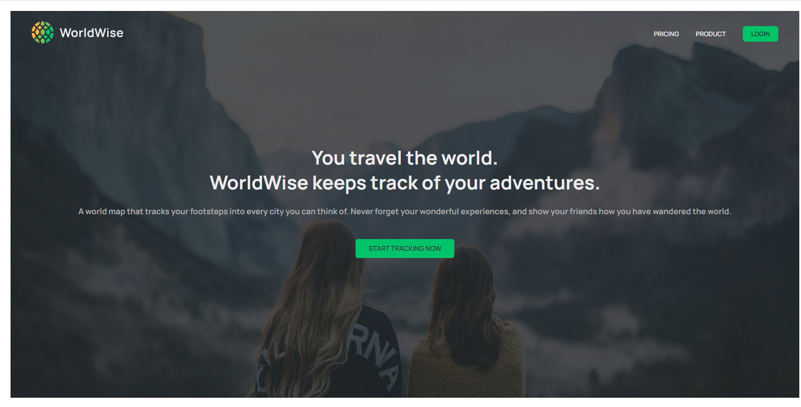
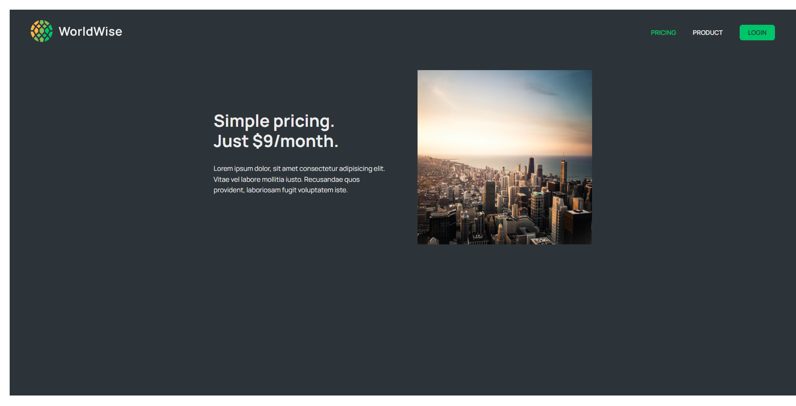
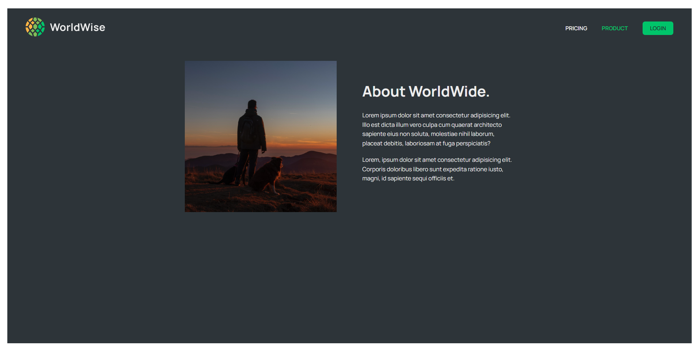
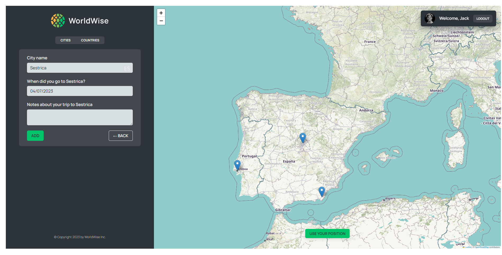
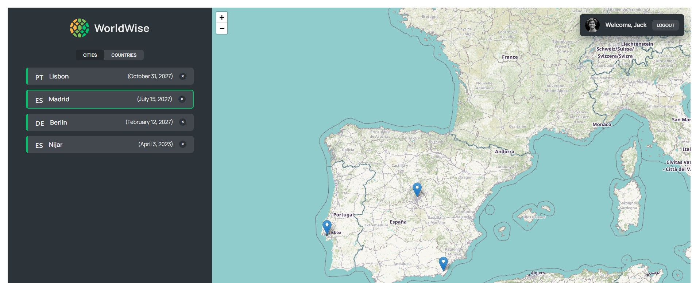

# WordlWise

## Table of contents

- [Overview](#overview)
  - [Review](#Review)
  - [Screenshots](#screenshots)
  - [Link](#link)
  - [Built with](#built-with)
- [Author](#author)

## Overview

### Review

React based project: WorldWise. You can start a trip, see the price and product, select the desired location and add it. Project made by Fake API, If you want to see the project, you have to start the server first

### Screenshots

### Link

- Solution URL: [GitHub](https://github.com/nikamerebashvili95/worldwise)

### Built with

- React
- Fake API
- Redux
- Router

## Author

- GitHub - [Nika Merebashvili](https://github.com/nikamerebashvili95)
- LinkedIn - [Nika Merebashvili](https://www.linkedin.com/in/nikamerebashvili)
- Portfolio - [Portfolio](https://nikamerebashvili95.github.io/portfolio-website/)
